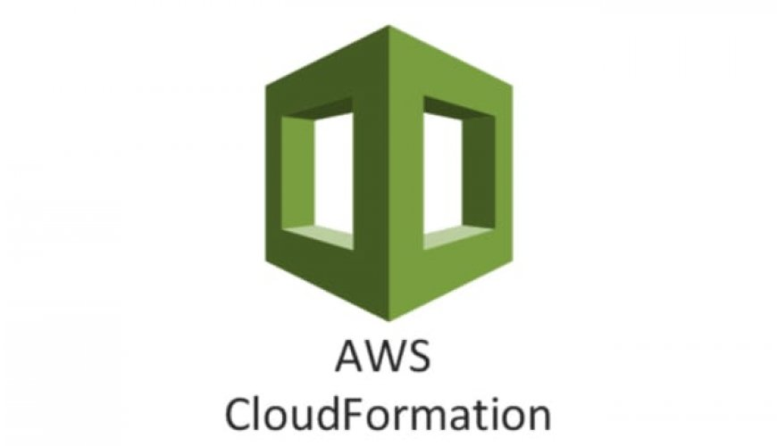

# Versionamiento en AWS Api Gateway con AWS Cloud Formation

## Autores

* **Johann Steven Bogotá Vélez**  - Escuela Colombiana de Ingeniería Julio Garavito
* **Johan Stiven Guerrero Pineda**  - Escuela Colombiana de Ingeniería Julio Garavito

## Herramientas Utilizadas

| Api Gateway | Cloud Formation | Lambda | Python |
| ------ | ------ | ------ | ------ |
|  |  |  |  |

## Descripción
En este experimento se genera la migración de una función lambda de una API en la herramienta de AWS Gateway, con ayuda del servicio CloudFormation 
que trata la infraestructura como código. Con los archivos propuestos en este repositorio, se genera una plantilla base y con la ayuda de un script en Python,
se proporciona la plantilla con una cantidad n de recursos apuntando a una lambda, permitiéndonos su creación. Para luego con ayuda de otro script crear los recursos
necesarios para la actualización y migración de las diferentes etapas creadas en primer lugar.

## Cómo Usar

En el repositorio se encuentran plantillas base las cuales tienen el modelo y bosquejo en los formatos permitidos JSON y YAML para la creación y actualización de un recurso en Api Gateway, 
este solo tiene implementado una etapa. Por lo que si va a la consola de AWS, en la herramienta CloudFormation puede crearlo sin ningún tipo de problema. 
la cual le creara una API con el nombre lambda-arep2021, CloudFormation se encargara del despliegue y de crear todos los recursos descritos en la plantilla inicial.
A partir de aquí puede hacer que este migre con ayuda de una segunda plantilla con el nombre de migración, la cual modifica los recursos y crea un nuevo despliegue
con una marca de tiempo. Si entra al Stack creado con la plantilla inicial, puede encontrar un botón para actualizarlo y con lo cual subirá el nuevo recurso
de la plantilla actualizada y ya con esto CloudFormation modificara los recursos que se describieron.

A partir de aquí con ayuda de los scripts de Python se generaliza las plantillas y podemos simular mas etapas que apunten a una lambda para posteriormente migrarlos.
## Cómo Ejecutar Scripts

1.  Se tiene una copia en el directorio base de una plantilla prueba, que es una copia de la plantilla inicial en formato JSON sin ninguna etapa creada. Haga una copia de este archivo
    y renómbrelo como prueba.json con ayuda del primer script en python modificamos su contenido para determinar cuantas etapas mas se quieren crear. Por defecto esta en 15.
    y ejecutamos el archivo ya sea por un IDLE o con el por en consola de comandos en Windows colocamos la dirección del archivo .py o en Linux ejecutamos el siguiente comando.

```sh
python3 1.scriptCreateStagesJson.py
```

2.  Procedemos a ir a la consola de AWS, en el servicio CloudFormation y creamos un nuevo Stack con la plantilla prueba.json, la cual nos mostrara los recursos a crear y los tiempos.
    Podemos revisar el recurso de AWS Api Gateway creado.

3.  Con este archivo prueba.json procedemos a ejecutar el segundo script para modificar los n stages creados en la primera etapa. Con este ingresamos al stack y le damos a actualizar
    y subimos nuevamente el archivo prueba.json actualizado, y CloudFormation cambiara los recursos.

```sh
python3 2.scriptCreateDeployments.py
```  

>> Nota: recuerde modificar la plantilla base para apuntar a las funciones lambda que tenga creadas y cambiar los parametros como nombre entre otros.

## Licencia

This project is under MIT License - [LICENSE](LICENSE) file for details.